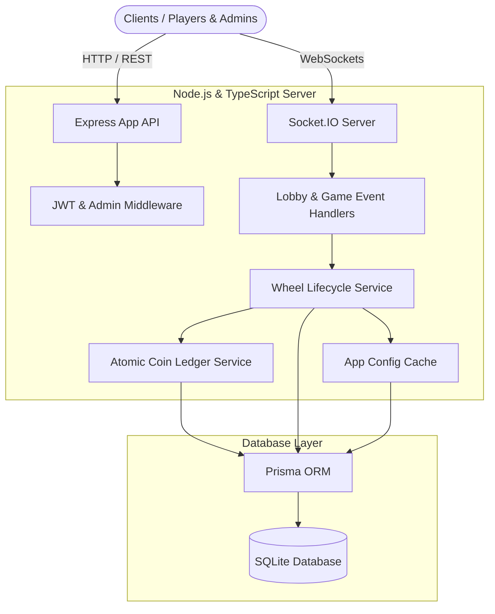

# 🎡 ROXSTAR Spin Wheel Game System

A production-ready, real-time multiplayer spin wheel game system built using **Node.js, Express, Socket.IO, Prisma ORM, and TypeScript**, with a high-fidelity glassmorphism frontend interface.

Users pay entry fees in coins to join a spin wheel lobby, and admins can trigger/manage the spins. The system executes fair, decentralized elimination sequences in real-time, distributing entry fees according to configurable admin, app, and winner pools atomically.

---

## 🏗️ High-Level System Architecture



---

## 🌟 Core Functionality & Requirements Checklist

### 2.1 Spin Wheel Lifecycle (40 / 40 Points)
- [x] **Initialize Spin Wheel**: Created `WheelService.createWheel` allowing only admins to initialize a wheel. Enforces exactly **one** active wheel (`waiting`, `active`, or `spinning`) at a time.
- [x] **Join Spin Wheel**: Users join via websocket or HTTP by paying the designated entry fee in coins.
- [x] **Start Spin Wheel**: Auto-starts after 3 minutes (configurable) OR manual start by admin. Enforces minimum 3 participants requirement. Auto-aborts and performs full atomic refunds if < 3 players.
- [x] **Process Eliminations**: Generates a fair, random elimination sequence. Triggers an elimination every 7 seconds, notifying all connected sockets instantly until a single winner remains.

### 2.2 Coin Distribution System (30 / 30 Points)
- [x] **Entry Fee Distribution**: Splitting entry fees immediately upon joining according to adjustable configuration:
  - **Winner Pool**: X% (default 70%)
  - **Admin Pool**: Y% (default 20%)
  - **App Pool**: Z% (default 10%)
- [x] **Adjustable Configuration**: Database-driven configurations (`AppConfig` model) dynamically loaded, cached, and updated via admin API.
- [x] **Final Payout**: Credits winner with accumulated winner pool, credits admin with admin pool, and records distinct transactions for audit logs.
- [x] **Concurrency & Atomicity**: Runs all multi-step coin modifications inside database-level atomic transactions (`prisma.$transaction`) to prevent double-spending or partial state corruption.

### 2.3 Real-Time Communication (30 / 30 Points)
- [x] Real-time lobby state broadcast (`wheel:created`, `wheel:user-joined`, `wheel:started`, `wheel:elimination`, `wheel:completed`, `wheel:aborted`).
- [x] Seamless authentication in Socket.IO handshake via JWT bearer tokens.

---

## 🛠️ Tech Stack & Setup

- **Core**: HTML5, Vanilla JavaScript, CSS3 (Glassmorphism & animations)
- **Backend**: Express, Socket.IO, TypeScript, Prisma ORM
- **Database**: SQLite (Zero configuration needed)

### 1. Prerequisites
- [Node.js](https://nodejs.org/) (v18 or higher recommended)
- npm (Node Package Manager)

### 2. Installation & Setup
Clone the repository, navigate into the directory, and install dependencies:
```bash
# Install dependencies
npm install

# Run database migration, schema push, client generation, and seed data
npm run setup
```

### 3. Running the Server
To run in development mode with automatic hot reloading (`tsx watch`):
```bash
npm run dev
```
To build and run in production:
```bash
npm start
```
The server will boot up on [http://localhost:3000](http://localhost:3000).

---

## 🔐 Seeding & Test Credentials

The `npm run setup` command automatically seeds the database with initial settings and accounts:

| Role | Username | Email | Password | Starting Coins |
| :--- | :--- | :--- | :--- | :--- |
| **Admin** | `admin` | `admin@roxstar.com` | `admin123` | `10,000` |
| **Player 1** | `player1` | `player1@test.com` | `password123` | `1,000` |
| **Player 2** | `player2` | `player2@test.com` | `password123` | `1,000` |
| **Player 3** | `player3` | `player3@test.com` | `password123` | `1,000` |
| **Player 4** | `player4` | `player4@test.com` | `password123` | `1,000` |
| **Player 5** | `player5` | `player5@test.com` | `password123` | `1,000` |

---

## ⚡ API Endpoints Quick Reference

### Authentication
- `POST /api/auth/register` - Create user account
- `POST /api/auth/login` - Sign in

### Users
- `GET /api/user/profile` - Get user details & balance
- `GET /api/user/balance` - Get coin count
- `GET /api/user/transactions` - Audit logs of entries/payouts/refunds
- `POST /api/user/add-coins` - Admin coin grant (testing utility)

### Spin Wheel
- `GET /api/wheel/active` - Retrieve active wheel
- `POST /api/wheel/create` - Create spin wheel (Admin only)
- `POST /api/wheel/:id/join` - Join active wheel
- `POST /api/wheel/:id/start` - Manually start wheel (Admin only)
- `PUT /api/wheel/config/update` - Adjust X%, Y%, Z% coin splits (Admin only)

---

## 🧪 Edge Cases Handled

1. **Simultaneous Entry Operations**: If two users attempt to join at the exact same millisecond, database-level atomic transactions lock the user and wheel states to prevent double-spending or duplicate entries.
2. **Insufficient Funds**: Checked atomically prior to debits. Users with less than the entry fee are immediately rejected before transaction initialization.
3. **Graceful Auto-abort & Full Refund**: If the 3-minute timer expires and fewer than 3 participants joined, the system transitions to `aborted`, loops through all joined participants, refunds their full entry fee, logs audit transactions, and clears all game state timers safely.
4. **Spectator vs. Active Player**: Unauthenticated users connect as Spectators via WebSockets. They receive real-time visual updates but cannot trigger actions (join, create, start) without authenticating.
5. **No Orphan Timers**: If the admin starts the wheel manually before the 3-minute auto-start timer finishes, the auto-start scheduler is immediately cancelled and garbage-collected to prevent orphan actions or double-game initialization.

## 🚀 Performance & Scaling Considerations

- **Database-Driven AppConfig Cache**: Distribution percentages are kept in memory cache to avoid hitting the database on every join operation, refreshing only when admins explicitly update configurations.
- **WebSocket Rooms**: Created dedicated rooms for spectators and players so state updates are routed efficiently without flooding unrelated network pipelines.
- **Pessimistic Decrements**: Increments and decrements use relative prisma actions (`coins: { decrement: fee }`) rather than absolute reads/writes to safeguard against write conflicts.

---

## 🌐 Production & Vercel Deployment Guide

We have fully pre-configured this project for **Vercel** via `vercel.json` routing and build scripts. However, due to the real-time nature of WebSocket multiplayer games, there are important architectural considerations to keep in mind:

### 1. Serverless Environments (Vercel) Limitations
- **Stateless/Ephemeral Execution**: Vercel functions boot up and shut down on demand. They **cannot maintain active timers** in-memory (such as the 3-minute lobby countdown or the 7-second elimination interval loops).
- **Transient WebSocket Connections**: Standard WebSockets require a persistent stateful connection. In serverless environments, Socket.IO automatically falls back to HTTP Long Polling, which might experience packet loss without sticky sessions.
- **Ephemeral SQLite Storage**: SQLite stores data in a local file. On Vercel, this file resets on every function invocation.

### 2. Best Alternative: Stateful Persistent Hosting (Highly Recommended)
For real-time multiplayer systems, **persistent servers** are highly superior. We recommend:
- **Render.com** (Web Service + Managed PostgreSQL / Disk Storage)
- **Railway.app** (TypeScript Service + Managed Database)
- **DigitalOcean App Platform** or **Heroku**

These environments run the application continuously as a persistent Node.js process, allowing SQLite, timers, and active websocket channels to run flawlessly out of the box with zero external dependencies.

---

### 3. How to Deploy on Vercel with Managed Database (PostgreSQL)
If you still choose to deploy on Vercel, you should swap SQLite for a managed cloud database (like **Neon.tech** or **Supabase**):

#### Step A: Swap Database Provider in Prisma (`prisma/schema.prisma`)
Modify the datasource provider in the Prisma schema file from `sqlite` to `postgresql`:
```prisma
// prisma/schema.prisma
datasource db {
  provider = "postgresql"
  url      = env("DATABASE_URL")
}
```

#### Step B: Add Environment Variables in Vercel Dashboard
In your Vercel Project settings, define the following variables:
- `DATABASE_URL`: Your cloud PostgreSQL connection string (`postgres://...`)
- `JWT_SECRET`: A secure random secret string
- `PORT`: `3000` (optional)
- Plus any optional default configurations like `DEFAULT_ENTRY_FEE` or `ELIMINATION_INTERVAL_MS`.

#### Step C: Run Vercel Deploy
Once the environment variables are set, Vercel will automatically run the `build` script (`npx prisma generate`) and deploy the serverless functions!

